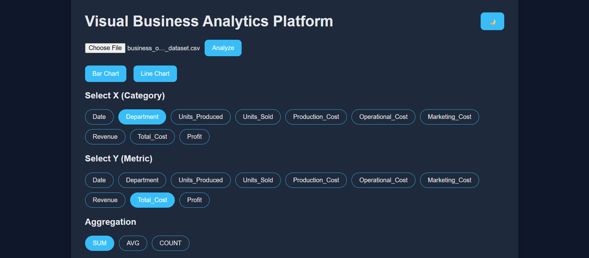
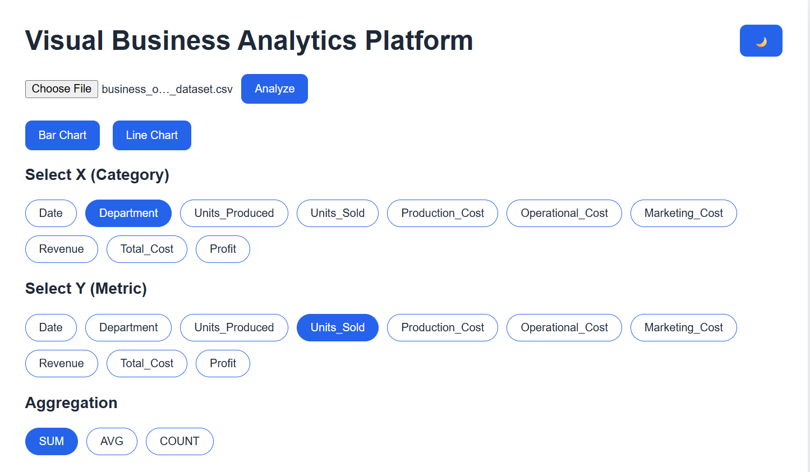

# 📊 DataVista – Interactive Business Analytics Dashboard

DataVista is a **web-based business analytics dashboard** that enables users to upload CSV files and instantly generate **clean, aggregated, and interactive visual insights**.  
The application is designed with a **Big 4–style analyst mindset**, focusing on usability, clarity, and decision-oriented analytics rather than raw data plotting.

---

### 🔗 Live Website: [DataVista](https://data-vista-six.vercel.app/)
---
### 🎬 Sample Video: [Video Link](https://drive.google.com/file/d/15hElu_w44BJxNWkQYcR1Knng9f5rCGAw/view?usp=sharing)
---
### 🎬 Sample Dataset : [Clean CSV File](https://drive.google.com/file/d/1RyzFDjb4iZ1saqWCaz5P6GvzlvqRiiT_/view?usp=sharing)
---
## 📸 Screenshots

| Dataset and Columns | Bar Graph | 
|----------------|--------------|
|  |  |

| Dataset and Columns | Line Graph | 
|----------------|--------------|
|  |  |

---
## 🚀 Key Features

- 📁 **CSV Upload & Analysis**
- 📊 **Interactive Bar & Line Charts**
- 🔢 **Dynamic Aggregation**
  - SUM (default)
  - AVG
  - COUNT
- 🎯 **Pill-based Column Selection** (industry-style filters)
- 🌙 **Dark / Light Theme Toggle**
- 🧮 **Automatic Data Aggregation** for clean visualizations
- ⚡ **Fast & Responsive UI**
- ☁️ **Serverless Deployment on Vercel**

---

## 🧠 Why DataVista?

Business teams often rely on CSV files but lack quick tools to extract insights without writing code.  
DataVista bridges this gap by transforming raw CSV data into **decision-ready analytics** using intuitive controls and professional-grade visuals.

---

## 🛠 Tech Stack

**Frontend**
- HTML5
- CSS3 (Dark/Light Theme using CSS variables)
- JavaScript (Vanilla JS)
- Chart.js

**Backend**
- Flask (Python)
- Pandas (Data processing & aggregation)

**Deployment**
- Vercel (Serverless Functions)

**Version Control**
- Git & GitHub

---

## 📂 Project Structure
``` php
csv-business-analyzer/
│
├── api/
│ └── index.py # Flask backend (serverless)
│
├── templates/
│ └── index.html # Main UI
│
├── static/
│ ├── style.css # Dark / Light theme styles
│ └── chart.js # Frontend logic & chart handling
│
├── requirements.txt # Python dependencies
├── vercel.json # Vercel configuration
├── .gitignore
└── README.md
```


---

## ⚙️ How It Works

1. Upload a CSV file  
2. Click **Analyze**  
3. Choose chart type (**Bar / Line**)  
4. Select:
   - X-axis (Category)
   - Y-axis (Metric)
   - Aggregation (**SUM / AVG / COUNT**)  
5. Generate interactive charts instantly  

> ⚠️ Raw rows are never plotted directly.  
> DataVista aggregates data to ensure **clean, readable, and meaningful visualizations**.

---

## ▶️ Run Locally

### 1️⃣ Install Dependencies
```bash
pip install flask pandas
```
### 2️⃣ Start the App
```bash
python app.py
```

